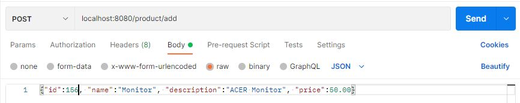

# Spring-boot-rest-api
#### A simple REST API which performs the 4 CRUD operations on a Product entity

# Architecture


# Product
```
@Entity
public class Product {

    @Id
    @GeneratedValue(strategy = GenerationType.AUTO)
    private long id;
    private String name;
    private String description;
    private double price;
    
}
```

#### The Product class has the **@Entity** and **@Id** annotations which allows JPA to recognise Product as an entity and create a table for it in the database.

# Create
#### Creating 2 products - Monitor & Keyboard




# Read
#### Reading list of all products which displays the 2 products we created earlier


# Update
#### Updating the description and price of the Keyboard product


# Delete
#### Deleting the Keyboard product


